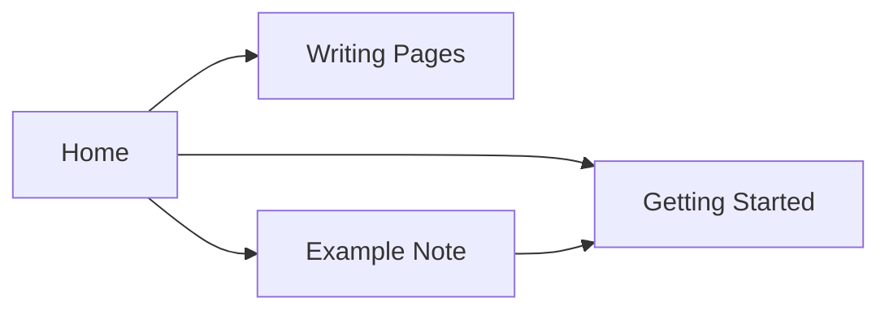

Pages support standard Markdown plus a few extras.

## Callouts

> [!note]
> A general note.

> [!warning]
> Something to be careful about.

> [!tip]
> A helpful suggestion.

## Code blocks with syntax highlighting

```python
def greet(name: str) -> str:
    return f"Hello, {name}!"
```

## Math (LaTeX)

Inline: $E = mc^2$

Block:

$$
\sum_{i=1}^{n} i = \frac{n(n+1)}{2}
$$

## Diagrams (Mermaid)



## Task lists

- [x] Set up the wiki
- [ ] Add your own content
- [ ] Delete these starter pages once you don't need them

## Cross-linking

Link to any other page with `[[path/to/page|Label]]` — see [[notes/example-note|Example Note]] for one linked back here.
